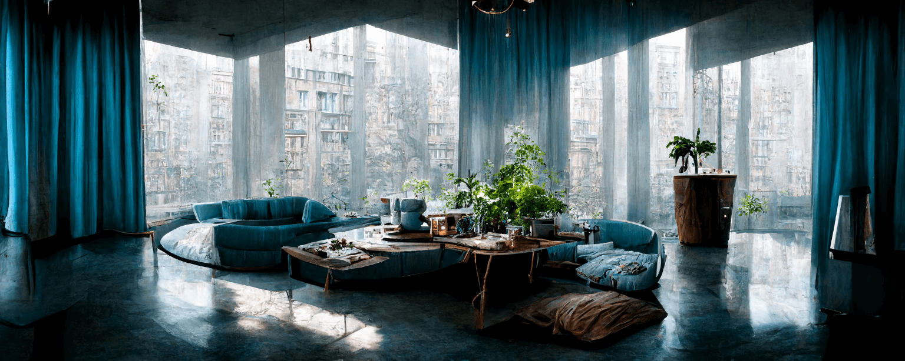

  

👋 &nbsp;**Hello**&nbsp;&nbsp;&nbsp; ℹ️ &nbsp;[Website](https://revcd.com)&nbsp;&nbsp;&nbsp; 🐦 &nbsp;[Twitter](https://twitter.com/revcd)&nbsp;&nbsp;&nbsp; 💼 &nbsp;[LinkedIn](https://www.linkedin.com/in/cdrev/)&nbsp;&nbsp; 🥋 [Katas](https://www.codewars.com/users/revett)

Recent projects:

- [`everyman-rss`](https://github.com/revett/everyman-rss) - RSS feeds for Everyman Cinema film releases
- [`sepias`](https://github.com/revett/sepias) - The CLI based personal knowledge management (PKM) tool

Ongoing utility projects:

- [`common`](https://github.com/revett/common) - Shared common code for my Go projects
- [`dev-playbook`](https://github.com/revett/dev-playbook) - Ansible playbook for macOS setup and configuration
- [`dotfiles`](https://github.com/revett/dotfiles) - macOS .files and configuration
- [`revcd.com`](https://github.com/revett/revcd.com) - Website
