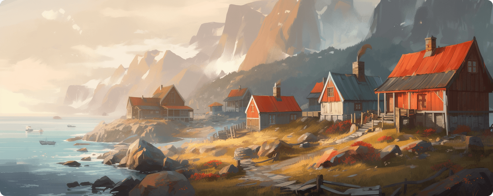

  

👋 &nbsp;**Hello**&nbsp;&nbsp;&nbsp; ℹ️ &nbsp;[Website](https://revcd.com?ref=github)&nbsp;&nbsp;&nbsp; 🐦 &nbsp;[Twitter](https://twitter.com/revcd)&nbsp;&nbsp;&nbsp; 💼 &nbsp;[LinkedIn](https://www.linkedin.com/in/cdrev/)&nbsp;&nbsp; 🥋 [Katas](https://www.codewars.com/users/revett)

Recent projects:

- [`rss-explore`](https://github.com/revett/rss-explore) - Tools to help you easily find and manage RSS feeds

Ongoing utility projects:

- [`common`](https://github.com/revett/common) - Shared common code for my Go projects
- [`dotfiles`](https://github.com/revett/dotfiles) - macOS .files and configuration
- [`umami-docker-hub-mirror`](https://github.com/revett/umami-docker-hub-mirror) - Mirrors of official [umami-software/umami](https://github.com/umami-software/umami/pkgs/container/umami) container images to Docker Hub

Archived projects:

- [`atlas`](https://github.com/revett/atlas) - (May 2023) CLI focused personal knowledge management tool
- [`revcd.com`](https://github.com/revett/revcd.com) - (May 2023) Personal website (migrated to [Super](https://super.so))
- [`everyman-rss`](https://github.com/revett/everyman-rss) - (April 2023) RSS feeds for Everyman Cinema film releases
