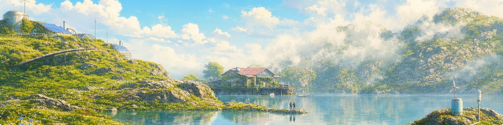

  

👋 &nbsp;**Hello**&nbsp;&nbsp;&nbsp; ℹ️ &nbsp;[Website](https://revcd.com?ref=github)&nbsp;&nbsp;&nbsp; 🪿 &nbsp;[X](https://x.com/8thpark)&nbsp;&nbsp;&nbsp; 💼 &nbsp;[LinkedIn](https://www.linkedin.com/in/cdrev/)

**Active project:**

- **[`Geode`](https://github.com/8thpark/geode) - Remote sync, MCP, and an API for your [Obsidian](https://obsidian.md) vault**

---

Other projects:

- [`dotfiles`](https://github.com/revett/dotfiles) - Dotfiles and Claude skills/configuration
- [`hops`](https://github.com/revett/hops) - Manage Homebrew packages across machines using a single YAML file
- [`typescript-as-go`](https://github.com/revett/typescript-as-go) - Skill to enforce agents to write TypeScript as if it were Go 
- [`website`](https://github.com/revett/website) - Personal website
